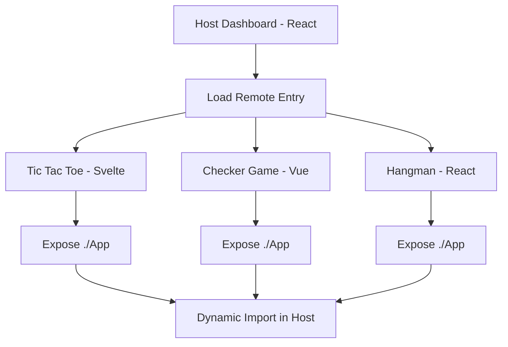

# 🎮 Games Hub - Microfrontend Architecture

A modern microfrontend architecture demonstrating the integration of multiple frontend frameworks (React, Vue, Svelte) using Webpack Module Federation and Vite.

## 🏗️ Architecture Overview

This project showcases a **Host-Remote** microfrontend pattern where:

- **Host Application**: React + Vite dashboard that orchestrates and displays all games
- **Remote Applications**: Independent game applications built with different frameworks
  - 🎯 **Tic Tac Toe**: Built with Svelte
  - ♟️ **Checker Game**: Built with Vue.js  
  - 🎪 **Hangman**: Built with React

## 📁 Project Structure

```
webpack-micro/
├── apps/
│   ├── host-dashboard/          # React Host (Port 3000)
│   │   ├── src/
│   │   │   ├── App.jsx         # Main dashboard component
│   │   │   ├── App.css         # Dashboard styles
│   │   │   └── main.jsx        # Entry point
│   │   ├── vite.config.js      # Vite + Module Federation config
│   │   └── package.json
│   │
│   ├── tictactoe-svelte/       # Svelte Remote (Port 3001)
│   │   ├── src/
│   │   │   └── App.svelte      # Exposed component
│   │   ├── vite.config.ts      # Vite + Federation config
│   │   └── package.json
│   │
│   ├── checker-vue/            # Vue Remote (Port 3002)
│   │   ├── src/
│   │   │   └── App.vue         # Exposed component
│   │   ├── vite.config.ts      # Vite + Federation config
│   │   └── package.json
│   │
│   └── hangman-react/          # React Remote (Port 3003)
│       ├── src/
│       │   └── App.tsx         # Exposed component
│       ├── vite.config.ts      # Vite + Federation config
│       └── package.json
│
├── package.json                # Root workspace config
├── pnpm-workspace.yaml         # Workspace definition
└── README.md                   # This file
```

## 🚀 Getting Started

### Prerequisites

- Node.js (v16 or higher)
- npm or pnpm

### Installation

1. **Clone the repository**
   ```bash
   git clone <repository-url>
   cd webpack-micro
   ```

2. **Install dependencies for all applications**
   ```bash
   # Install dependencies for each app
   cd apps/host-dashboard && npm install
   cd ../tictactoe-svelte && npm install
   cd ../checker-vue && npm install
   cd ../hangman-react && npm install
   ```

### Development

#### Option 1: Start All Applications (Recommended)

Open 4 separate terminals and run:

```bash
# Terminal 1 - Host Dashboard
cd apps/host-dashboard
npm run dev

# Terminal 2 - Tic Tac Toe (Svelte)
cd apps/tictactoe-svelte
npm run dev

# Terminal 3 - Checker Game (Vue)
cd apps/checker-vue
npm run dev

# Terminal 4 - Hangman (React)
cd apps/hangman-react
npm run dev
```

#### Option 2: Individual Applications

Start any individual application:

```bash
# Host Dashboard only
cd apps/host-dashboard && npm run dev

# Individual games
cd apps/tictactoe-svelte && npm run dev
cd apps/checker-vue && npm run dev
cd apps/hangman-react && npm run dev
```

### Accessing the Applications

- **🏠 Host Dashboard**: http://localhost:3000
- **🎯 Tic Tac Toe**: http://localhost:3001
- **♟️ Checker Game**: http://localhost:3002
- **🎪 Hangman**: http://localhost:3003

## 🔧 Module Federation Configuration

### Host Configuration (React + Vite)

```javascript
// apps/host-dashboard/vite.config.js
import federation from '@originjs/vite-plugin-federation'

export default defineConfig({
  plugins: [
    react(),
    federation({
      name: 'host-dashboard',
      remotes: {
        tictactoeApp: 'http://localhost:3001/assets/remoteEntry.js',
        checkerApp: 'http://localhost:3002/assets/remoteEntry.js',
        hangmanApp: 'http://localhost:3003/assets/remoteEntry.js',
      },
      shared: ['react', 'react-dom']
    })
  ]
})
```

### Remote Configuration Examples

#### Svelte Remote
```javascript
// apps/tictactoe-svelte/vite.config.ts
federation({
  name: 'tictactoeApp',
  filename: 'remoteEntry.js',
  exposes: {
    './App': './src/App.svelte'
  },
  shared: ['svelte']
})
```

#### Vue Remote
```javascript
// apps/checker-vue/vite.config.ts
federation({
  name: 'checkerApp',
  filename: 'remoteEntry.js',
  exposes: {
    './App': './src/App.vue'
  },
  shared: ['vue']
})
```

#### React Remote
```javascript
// apps/hangman-react/vite.config.ts
federation({
  name: 'hangmanApp',
  filename: 'remoteEntry.js',
  exposes: {
    './App': './src/App.tsx'
  },
  shared: ['react', 'react-dom']
})
```

## 🎯 Key Features

### ✨ Framework Agnostic
- **React** for the host dashboard
- **Svelte** for lightweight, reactive components
- **Vue.js** for progressive enhancement
- **React** for component reusability

### 🔄 Dynamic Loading
- Remote applications are loaded on-demand
- Graceful fallbacks with loading states
- Error boundaries for failed remote loads

### 🎨 Modern UI/UX
- Beautiful gradient backgrounds
- Responsive grid layouts
- Smooth animations and transitions
- Mobile-friendly design

### 🏗️ Development Experience
- Hot module replacement for all frameworks
- Independent development and deployment
- Shared dependencies optimization
- TypeScript support across all apps

## 🛠️ Technology Stack

| Component | Technology | Purpose |
|-----------|------------|---------|
| **Host** | React + Vite | Main dashboard and orchestration |
| **Remote 1** | Svelte + Vite | Tic Tac Toe game |
| **Remote 2** | Vue + Vite | Checker board game |
| **Remote 3** | React + Vite | Hangman word game |
| **Federation** | @originjs/vite-plugin-federation | Module federation |
| **Bundler** | Vite | Fast development and building |
| **Styling** | CSS3 + Modern Features | Gradients, flexbox, grid |

## 🚦 Build Process

### Development Build
```bash
# Each app runs independently
npm run dev  # In each app directory
```

### Production Build
```bash
# Build all applications
cd apps/host-dashboard && npm run build
cd ../tictactoe-svelte && npm run build
cd ../checker-vue && npm run build
cd ../hangman-react && npm run build
```

## 🔍 How It Works

1. **Host Application** starts and loads the main dashboard
2. **Remote Entry Points** are fetched from each remote application
3. **Dynamic Imports** load remote components when needed
4. **Shared Dependencies** are deduplicated across applications
5. **Runtime Integration** allows seamless interaction between frameworks

### Module Federation Flow



## 🎮 Game Features

### 🎯 Tic Tac Toe (Svelte)
- Classic 3x3 grid gameplay
- Player vs Player mode
- Win detection and game reset
- Lightweight Svelte implementation

### ♟️ Checker Game (Vue)
- Strategic board game
- Move validation
- Progressive Vue.js architecture
- Reactive state management

### 🎪 Hangman (React)
- Word guessing game
- Visual hangman drawing
- Letter tracking
- React hooks implementation

## 🔧 Troubleshooting

### Common Issues

1. **Remote not loading**
   - Ensure all remote applications are running
   - Check console for CORS errors
   - Verify port configurations

2. **Module not found errors**
   - Run `npm install` in each app directory
   - Check import paths in federation config

3. **Build failures**
   - Clear node_modules and reinstall
   - Check TypeScript configurations
   - Verify Vite plugin versions

### Development Tips

- Start remotes before the host for best experience
- Use browser dev tools to inspect module federation
- Check network tab for remote entry loading
- Monitor console for federation-specific errors

## 📚 Learning Resources

- [Module Federation Documentation](https://webpack.js.org/concepts/module-federation/)
- [Vite Plugin Federation](https://github.com/originjs/vite-plugin-federation)
- [Microfrontend Architecture Patterns](https://martinfowler.com/articles/micro-frontends.html)

## 🤝 Contributing

1. Fork the repository
2. Create a feature branch
3. Make your changes
4. Test across all applications
5. Submit a pull request

## 📄 License

This project is licensed under the MIT License - see the LICENSE file for details.

---

**Built with ❤️ using Microfrontend Architecture**

*Demonstrating the power of framework-agnostic, scalable frontend development*
